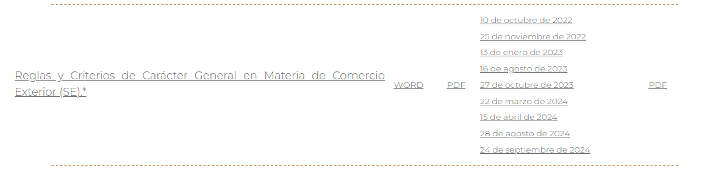

# Introducción {-}

El aviso automático de importación de productos siderúrgicos (AAIPS) son una restricción no arancelaria que se debe cumplir para importar acero o productos siderúrgicos.
En este reporte es de nuestro interés mostrar:

- Las motivaciones para establecer esta restricción.
- Los cambios en su cumplimiento.
- La evolución en las autorizaciones otorgadas por fracción, volumen, origen, entre otros.


## Marco regulatorio de los AAIPS

### Justificación del AAIPS como restricción no arancelaria 

La siguiente justificación se fundamenta en lo establecido en la reforma del Acuerdo de Secretaría de Economía en abril 2024.

-En Mayo de 2018, Estados Unidos impuso aranceles del 25% sobre el acero proveniente de México y como represalia el país impuso aranceles a diversos productos originarios de Estados Unidos. Sin embargo en mayo de 2019 posterior a negociaciones bilaterales se retiraron las barreras arancelarias implementadas por ambos paises. Sin embargo, si se presentará un incremento sustancial de las importaciones de acero, el país afectado podría imponer de nuevo dichas barreras.

-La secretaría de economía de México y la USTR de Estados Unidos establecieron en febrero de 2024 la necesidad de incrementar el control de las importaciones de acero. En dicho dialogo, se estableció como una acción conveniente que México solicite el certificado de molino y de calidad como requisito para la autorización del aviso automático.
También pareció pertinente actualizar los requisitos de documentación e información. 

Sin embargo también se creó la modalidad de inscribirse en un Registro de Importadores de Productos Siderúrgicos con el fin de facilitar el trámite a los usuarios de comercio exterior.

Además se incorporaron 72 fracciones arancelarias más en dicho requerimiento.

Se han hecho muchos cambios en el acuerdo de la Secretaría de Economía, aunque no todos se refieren a los requisitos de los AAIPS.

A continuación se presenta el listado de las últimas modificaciones. De las cuales, la reforma de Octubre de 2022 y de Abril de 2024 han afectado la manera en que se presenta el trámite.


```{r figModificaciones, fig.cap="Modificaciones al acuerdo",echo=FALSE}

```

Aquellos cambios que han modificado los articulos que abordan los requerimientos para el cumplimiento en AAIPS.

Reformas a las reglas

| Fecha de publicación | Artículos     | Comentario  |
|---|-------|------------|
|2024-04-15| 2.2.19    | Establece la información que debe contener el certificado de molino y de calidad. falta mencionar que cambio se realizó.|
|2024-04-15| 2.2.26    | Establece la información que debe ser presentada en la solicitud del AAIPS. |
|2022-10-10| 2.2.19   | Establece la información que debe contener el certificado de molino y de calidad.  |
|2022-10-10| 2.2.26    | Establece la información que debe ser presentada en la solicitud del AAIPS.  Falta qué cambio se realizó|


Así citas en el documento [@smith2020data]


## Propuesta de estructura de ChatGPT - pendiente revisar

Para presentar un **reporte estructurado** que sea útil para los **gerentes de comercio exterior** de las empresas siderúrgicas, se deben considerar los siguientes aspectos clave:

### **Estructura del Reporte**

#### **1. Portada y Resumen Ejecutivo**
- **Título:** _Reporte de Avisos Automáticos de Importación de Productos Siderúrgicos (AAIPS) - 2019-2024_
- **Resumen Ejecutivo:** Breve descripción de la evolución de las autorizaciones, principales tendencias y cambios en las regulaciones publicadas en el DOF.
- **Objetivo:** Facilitar el análisis de la disponibilidad de insumos siderúrgicos importados y cumplimiento regulatorio.
- **Fuentes de datos:** SNICE, DOF, bases de datos de AAIPS.

---

#### **2. Indicadores Clave de Desempeño (KPIs)**
- **Total de AAIPS autorizados por año y mes.**
- **Tiempo promedio de resolución (en días).**
- **Principales fracciones arancelarias autorizadas.**
- **Distribución por país de origen y exportador.**
- **Volumen total autorizado por fracción arancelaria y NICO.**
- **Empresas con mayor número de autorizaciones.**

👉 **Formato:** Tablas y gráficos de barras/líneas para visualizar tendencias.

---

#### **3. Análisis de AAIPS por Año y Mes**
- **Tendencias de solicitud y autorización de AAIPS.**
- **Comparación anual y mensual de la cantidad de avisos aprobados.**
- **Volumen importado por periodo.**
  
👉 **Formato:** Tabla + gráficos de tendencia.

---

#### **4. Distribución por Fracción Arancelaria y NICO**
- **Principales fracciones arancelarias autorizadas.**
- **Volumen por fracción y NICO.**
- **Descripción de productos más importados.**
  
👉 **Formato:** Tablas dinámicas y gráficos circulares/barras.

---

#### **5. Análisis de Países de Origen y Exportadores**
- **Países con mayor volumen de exportación.**
- **Variación en los países de origen por año.**
- **Comparación entre país de origen y país exportador.**
  
👉 **Formato:** Mapas de calor y gráficos de barras.

---

#### **6. Principales Empresas Importadoras**
- **Ranking de empresas con más AAIPS autorizados.**
- **Volumen autorizado por empresa.**
- **Distribución por fracción y NICO de cada empresa.**
  
👉 **Formato:** Tablas y gráficos de barras.

---

#### **7. Cumplimiento Regulatorio y Publicaciones del DOF**
- **Principales modificaciones regulatorias (según el DOF).**
- **Impacto de nuevas reglas en la solicitud de AAIPS.**
- **Revisión de requisitos y cambios en procedimientos.**
  
👉 **Formato:** Tabla resumen de publicaciones relevantes.

---

#### **8. Conclusiones y Recomendaciones**
- **Resumen de tendencias clave.**
- **Riesgos y oportunidades para las empresas importadoras.**
- **Recomendaciones estratégicas para optimizar la gestión de AAIPS.**

---

### **Formato Final**
- **PDF/Presentación:** Para reportes ejecutivos.
- **Excel/Dashboard interactivo:** Para análisis detallado.

¿Te gustaría que genere una plantilla de este reporte en **Excel o Dashboard interactivo**? 🚀
